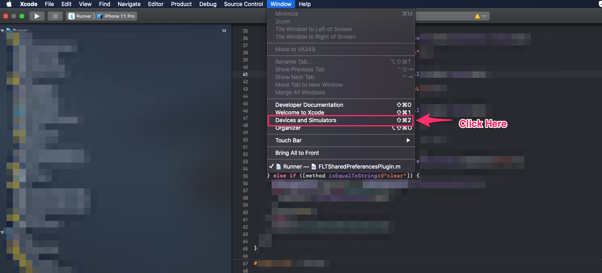
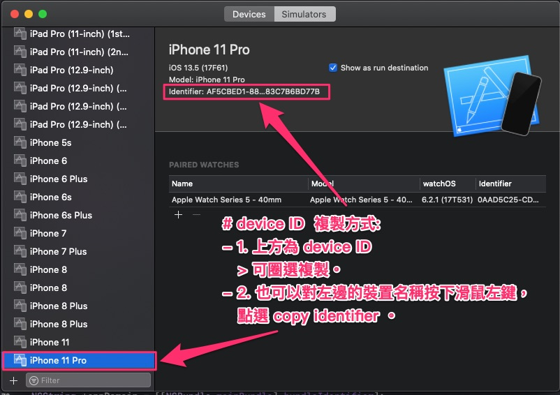
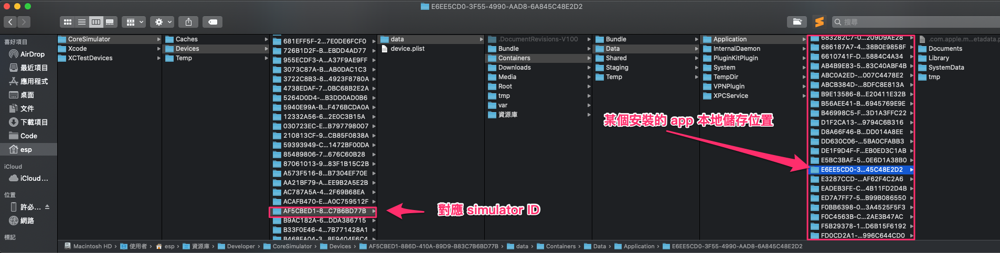
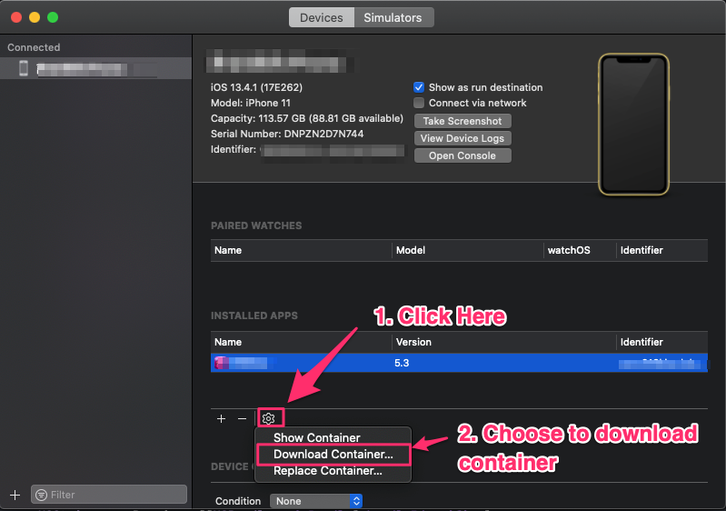

# AppContainerPos

- 說明 app Container 位置

---

## 大綱

- [AppContainerPos](#appcontainerpos)
  - [大綱](#大綱)
  - [Simulator (模擬器) 位置](#simulator-模擬器-位置)
  - [iPhone (實體機) 位置](#iphone-實體機-位置)

---

## Simulator (模擬器) 位置

- app 安裝於模擬器，mac 的檔案位置

  > ~/Library/Developer/CoreSimulator/Devices

  - [iphone - Is there any way to see the file system on the iOS simulator? - Stack Overflow](https://stackoverflow.com/questions/6480607/is-there-any-way-to-see-the-file-system-on-the-ios-simulator)

- 找尋對應模擬器的位置

  - 開啟 Xcode 上方選單 [Windows]/[Devices and Simulators]

    

  - 找尋安裝 app 所在的 simulator 版本

    

  - 接下來可以找尋所安裝的 app 本地儲存區塊

    

  > 可能用程式碼，dump document path 會比較快 (哈)

- 用 command line 方式 :

  - xcode simulator devices 路徑如下 :

    ```sh
    cd ~/Library/Developer/CoreSimulator/Devices
    ```

    > 此為所有的 simulator devices 的根目錄。

  - Device ID :

    切換到 simulator devices 後，

    可以下 `ls -al` 查看所有的資料夾。

    每個資料夾名稱都代表一個 Device ID。

    對應上述的 Device ID 會在這個資料夾下面有對應的內容。

  - 範例 :

    ```log
    total 24
    drwxr-xr-x  69 esp  staff   2208  6  1 17:37 .
    drwxr-xr-x   5 esp  staff    160  4  1 13:49 ..
    drwxr-xr-x@  4 esp  staff    128  4  6 18:03 0025B218-3891-4551-AD6F-55DE7B9D7C0F
    drwxr-xr-x@  4 esp  staff    128  3 16 16:58 00A7F0E4-AFE2-4608-837A-7BABEF86E4A9
    drwxr-xr-x@  4 esp  staff    128  3 16 16:58 00F918D7-1AE2-4F8F-AF16-FD5D5C9435F4
    drwxr-xr-x@  4 esp  staff    128  4  6 18:33 02237A65-45CA-4935-ADA7-AD1E409692F3
    drwxr-xr-x@  4 esp  staff    128  4  6 18:58 02691928-A0CE-4291-8DD1-5EFB9FEB5BED
    drwxr-xr-x@  4 esp  staff    128  3 16 16:58 03213B01-C7BE-4009-B6BE-59A7FA5CD6EC
    drwxr-xr-x@  4 esp  staff    128  4  6 18:58 059770F1-3596-4591-802D-6BA6E2ABE626
    drwxr-xr-x@  4 esp  staff    128  4  6 18:58 07A2760B-60B8-4794-B24C-9966F3DD8A11
    drwxr-xr-x@  4 esp  staff    128  3 16 16:58 0A9450D7-CD12-400A-8F77-7FC687E5346A
    drwxr-xr-x@  4 esp  staff    128  4  6 18:58 0AD814BC-3F25-4D2B-9A8E-F913FF442275
    drwxr-xr-x@  4 esp  staff    128  3 16 16:58 0EC124F3-24BC-45E4-B75E-E6E11A952060
    drwxr-xr-x@  4 esp  staff    128  4  6 18:58 128C9445-64B6-44C2-B716-492E9F595DA9
    drwxr-xr-x@  4 esp  staff    128  4  6 18:58 153AF199-44CD-4410-9379-FF6BD34F3228
    drwxr-xr-x@  4 esp  staff    128  4  6 18:33 182F929E-DFB8-4878-843C-356D82C03D99
    drwxr-xr-x@  4 esp  staff    128  4  6 18:58 1960E393-61BB-4425-BDC6-F33DDA4B0941
    drwxr-xr-x@  4 esp  staff    128  3 16 16:58 1D107B33-0FFF-4FFB-A1D5-7F0F58B58B7B
    drwxr-xr-x@  4 esp  staff    128  3 16 16:58 26CE726A-FB50-4EB6-834F-E24C8413FFBB
    drwxr-xr-x@  4 esp  staff    128  4  6 18:33 2E0042F1-992A-4DAC-A186-3B2B8A5151E9
    drwxr-xr-x@  4 esp  staff    128  3 16 16:58 308D86F7-05EC-4D22-A4E9-B9525A4A3F0B
    drwxr-xr-x@  4 esp  staff    128  4  6 18:58 324020A2-EB28-4ECC-9C26-7CE2079D1680
    drwxr-xr-x@  4 esp  staff    128  4  6 18:03 3667D31F-5357-4F59-8C32-326A1B187345
    drwxr-xr-x@  4 esp  staff    128  5  6 21:10 368062FA-E0F4-49BB-8D23-5694EC6E5FDE
    drwxr-xr-x@  4 esp  staff    128  4  6 17:51 3A75844C-5FD3-490F-BFB1-71866650EF5C
    drwxr-xr-x@  4 esp  staff    128  4  6 18:58 42041F39-730B-46E9-9C2A-1819B8286526
    drwxr-xr-x@  4 esp  staff    128  4  6 18:58 4A458031-948F-461F-9680-0ECF47C3F954
    drwxr-xr-x@  4 esp  staff    128  4  6 18:58 4E02C3EB-9AE1-4325-9024-0B7BD474588D
    drwxr-xr-x@  4 esp  staff    128  3 16 16:58 561E73E9-0A5F-4D02-9BAF-B9F73B23A9DC
    drwxr-xr-x@  4 esp  staff    128  4  6 18:58 5DB7E40A-3FD4-45D7-8436-A457FBEB2F29
    drwxr-xr-x@  4 esp  staff    128  4  6 18:58 681FF2E0-DF21-40EC-8A34-D46E5D998267
    drwxr-xr-x@  4 esp  staff    128  4  6 17:51 7299EB5A-BC2E-4114-8DE9-5F6B85509D82
    drwxr-xr-x@  4 esp  staff    128  4  6 17:51 729DC40D-39E0-4E22-915F-1377AB5A5283
    drwxr-xr-x@  4 esp  staff    128  3 16 16:58 78F9162F-48FD-43E9-821C-4877EDF1008A
    drwxr-xr-x@  4 esp  staff    128  4  6 18:33 79D48E65-5096-4F5C-9D5F-E081E92746FC
    drwxr-xr-x@  4 esp  staff    128  4  6 18:58 7AB77A63-48E5-467E-B9E2-452D4679CD51
    drwxr-xr-x@  4 esp  staff    128  3 16 16:58 7B69BF6F-0B42-4860-9768-D04DAF2195EF
    drwxr-xr-x@  4 esp  staff    128  4  6 18:33 7BF47E18-3952-474C-A120-32EE1C44D9A1
    drwxr-xr-x@  4 esp  staff    128  4  6 18:58 82C13590-373E-4EF9-8436-DA9DCB401681
    drwxr-xr-x@  4 esp  staff    128  4  6 18:58 83AEC0A3-1D58-4392-B58E-7A2AA1F5E38C
    drwxr-xr-x@  4 esp  staff    128  4  6 18:58 84E35159-8DBA-422D-9E95-8ADB2C64673A
    drwxr-xr-x@  4 esp  staff    128  4  6 18:03 86990B30-586B-46E1-A90E-BC752D31CBF9
    drwxr-xr-x@  4 esp  staff    128  4  6 18:33 910F3CD8-9BC8-4939-8988-EAD5EE62E3D1
    drwxr-xr-x@  4 esp  staff    128  3 16 16:58 9916BDC5-583A-4A07-B6C6-AB0A28E2D6DF
    drwxr-xr-x@  4 esp  staff    128  6  1 17:04 9B659B45-B9EA-4D84-BA49-136120C66F2B
    drwxr-xr-x@  4 esp  staff    128  4  6 18:58 9D465A14-0C4A-4104-9CB4-CB71521D4DA7
    drwxr-xr-x@  4 esp  staff    128  4  6 18:33 9D6F0282-ECB7-400D-81B2-311397CD249B
    drwxr-xr-x@  4 esp  staff    128  4  6 18:33 9F0E1411-CD0D-4E6B-9912-0D74E186B45F
    drwxr-xr-x@  4 esp  staff    128  3 16 16:58 A15CC383-FE7B-43D4-9F03-49A7BA2B7FBD
    drwxr-xr-x@  4 esp  staff    128  4  6 18:58 A3F9DF14-A91F-4591-A543-990034A1FCF5
    drwxr-xr-x@  4 esp  staff    128  3 16 16:58 B38C1C86-ED29-4027-94B3-8B11B844A5C5
    drwxr-xr-x@  4 esp  staff    128  3 16 16:58 C0601BB1-0774-41B8-AD5B-5715CEBE014B
    drwxr-xr-x@  4 esp  staff    128  3 16 16:58 C1FED49B-81C2-456E-AC9B-90E6BDAEB61F
    drwxr-xr-x@  4 esp  staff    128  4  6 18:58 C2D99D39-64BD-4479-8224-232F233D7FFB
    drwxr-xr-x@  4 esp  staff    128  4  6 18:58 C320A7B9-6077-43D7-87F2-908523EFDB4A
    drwxr-xr-x@  4 esp  staff    128  3 16 16:58 CD5A3082-E2B9-498F-A051-D256DD5F0FA6
    drwxr-xr-x@  4 esp  staff    128  3 16 16:58 CDCF537B-435D-4F1F-8458-23C68669D6AD
    drwxr-xr-x@  4 esp  staff    128  3 16 16:58 D05406D8-2A21-4E0C-90E5-891A6D48EE84
    drwxr-xr-x@  4 esp  staff    128  3 16 16:58 D39BC135-5A61-4909-A2D5-28F34C140FCC
    drwxr-xr-x@  4 esp  staff    128  4  6 18:33 D4907F27-6B59-407D-A3C1-ED4AF15D302D
    drwxr-xr-x@  4 esp  staff    128  4  6 18:58 D7C8789C-49CB-4625-97A2-D18C128212E9
    drwxr-xr-x@  4 esp  staff    128  4  6 18:33 DDAFDF04-E529-4FA7-9B1D-9CE1C9862484
    drwxr-xr-x@  4 esp  staff    128  4  6 18:33 E2DDF7B3-954D-4478-92FF-F632E5A02EBC
    drwxr-xr-x@  4 esp  staff    128  4  6 18:58 EEBB923C-51B4-4940-86F5-D10D796D8C27
    drwxr-xr-x@  4 esp  staff    128  4  6 18:58 F398A385-46D5-4BD3-ADA7-AACE9BF8B6A9
    drwxr-xr-x@  4 esp  staff    128  4  6 18:58 F4D7E3FA-149B-4127-91BD-091AB013A126
    drwxr-xr-x@  4 esp  staff    128  5  6 21:11 FF55EB56-A0ED-43DE-A7FA-8AE66C6F17C3
    -rw-r--r--@  1 esp  staff  10211  5 31 10:15 device_set.plist
    -rw-r--r--   1 esp  staff      0  6  1 17:37 devices.log

    ```

---

## iPhone (實體機) 位置

- 一樣回到 Xcode 的 [Devices and Simulator] 畫面

- 點選 Device 分頁

  

- 需注意的是，非 AppStore 安裝的才能看到，一般是 Development 自行安裝才能看到

- 可直接下載及取代，除錯本地檔案時還蠻方便的

---

[=> Top](#appcontainerpos)

[=> Go Back](../README.md)
