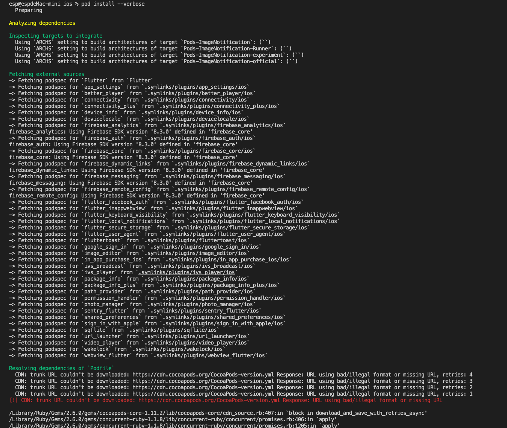
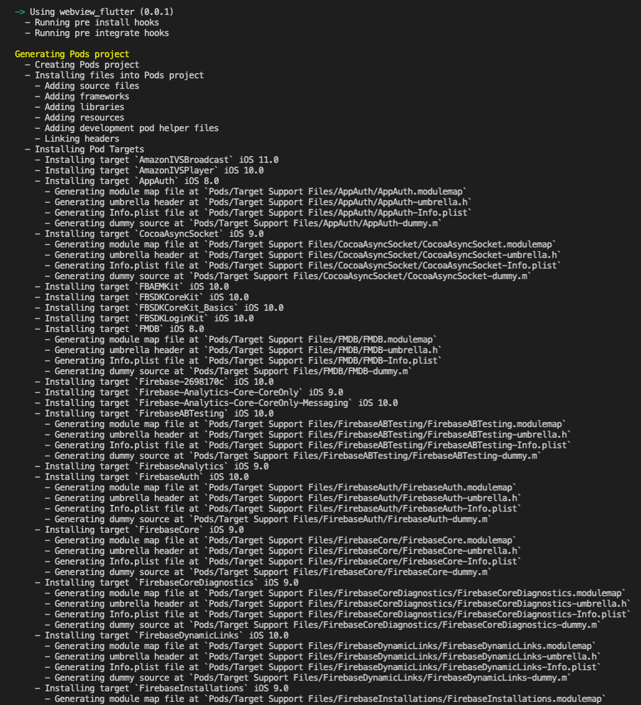

# Cocoapods CDN URL Fail Issue

---

## 大綱

- [Cocoapods CDN URL Fail Issue](#cocoapods-cdn-url-fail-issue)
  - [大綱](#大綱)
  - [緣由](#緣由)
  - [先說結論](#先說結論)
  - [過程說明](#過程說明)
    - [01-pod install fail](#01-pod-install-fail)
    - [02-uninstall cocoapods](#02-uninstall-cocoapods)
    - [03-install cocoapods](#03-install-cocoapods)
    - [04-pod install fail](#04-pod-install-fail)
    - [05-podfile add source url](#05-podfile-add-source-url)
    - [06-pod install fail](#06-pod-install-fail)
    - [07-pod cache clean And pod setup](#07-pod-cache-clean-and-pod-setup)
    - [08-pod install fail](#08-pod-install-fail)
    - [09-wgt_CocoaPods-version.yml](#09-wgt_cocoapods-versionyml)
    - [10-delete cocoapods local repository](#10-delete-cocoapods-local-repository)
    - [11-pod install success](#11-pod-install-success)
    - [12-iOS 模擬器測試](#12-ios-模擬器測試)
  - [延伸議題](#延伸議題)
  - [參考](#參考)

---
---

## 緣由

在開發過程，嘗試編譯 iOS 專案時，出現了與 cocoapods 的 CDN 問題。

簡單說是 cocoapods 預設的 repository CDN ， 有檔案無法下載 ， 導致後續無法完成。

---
---

## 先說結論

遇到預設的 CDN URL 無法下載，

下列的解決方式主要是在清除就有的本地資料。

> 沒刪除前，會一直抓取舊的 CDN URL。

然後在 Podfile 設定另外的 CDN URL 來源。

再重新下 pod install。

相關步驟如下 :

- 01 : 刪除 cocoapods 的 local repository 資料夾

  ```sh
  rm -rf ~/.cocoapods
  ```

- 02 : 修改 Podfile

  Podfile 最上方新增，指定 cocoapods 倉庫來源 source xxx

  有找到一篇文章的 source url ， 下面的是這次可以使用的， 其他的也有可能失敗。

  ```sh
  source 'https://github.com/CocoaPods/Specs.git'
  ```

- 03 : 重新下 pod install

  有 --verbose，可以看 dump log。

  ```sh
  pod install --verbose
  ```

---
---

## 過程說明

接下來說明遇到的問題，中間過程對應處理及其說明。

### 01-pod install fail

- command line :

  ```sh
  pod install --verbose
  ```

- terminal 截圖 :

  - `pod install --verbose` :

    

    ```sh
    [!] Unable to add a source with url `https://cdn.cocoapods.org/` named `trunk`.
    (/usr/bin/git clone https://cdn.cocoapods.org/ -- trunk

    Cloning into 'trunk'...
    fatal: repository 'https://cdn.cocoapods.org/' not found
    )
    You can try adding it manually in `/Users/esp/.cocoapods/repos` or via `pod repo add`.
    ```

  - `pod install` :

    

從中可以看出 cocoapods cnd url `https://cdn.cocoapods.org/` 出了問題。

> 不過當下沒注意到是 cdn 問題，從網路查找的文章中有提到降板可以成功。
>
> 原先的版本為 1.11.2
>
> 但嘗試降版 1.10.1 後，用原先的方式 pod install 還是會有問題。

---

### 02-uninstall cocoapods

如果 mac 之前有安裝多個 cocoapods 版本，

可以用下列的命令，一次全部刪除多個版本的 cocoapods。

- command line :

```sh
sudo gem list cocoapods --no-versions | xargs -L1 sudo gem uninstall
```

- terminal 截圖 :

  

---

### 03-install cocoapods

由於降版失敗，但有試出可以成功的方式，

後來重新安裝原先的 1.11.2 版本。

這邊跳過中間嘗試過程，只顯示最後裝回來的版本。

- command line :

  ```sh
  sudo gem install cocoapods
  ```

- terminal 截圖 :

  

---

### 04-pod install fail

重新安裝 cocoapods 後，重新下 pod install。

還是失敗，不過這次有出現檔案下載失敗的錯誤訊息。

- terminal 截圖 :

  

  ```sh
  [!] CDN: trunk URL couldn't be downloaded: https://cdn.cocoapods.org/CocoaPods-version.yml Response: URL using bad/illegal format or missing URL
  ```

---

### 05-podfile add source url

在 Podfile 新增 source，

在 Podfile 的上放，新增 `source 'https://github.com/CocoaPods/Specs.git'`。

- Podfile 截圖 :

  

  > 另外兩個 mark 起來的 source url，
  >
  > 是其他文章有提到，但嘗試結果是無法使用，仍然會失敗。

---

### 06-pod install fail

Podfile 加上 source 後，直接下命令 `pod install`，

一樣會失敗。

- terminal 截圖 :

  

  ```sh
  [!] CDN: trunk URL couldn't be downloaded: https://cdn.cocoapods.org/CocoaPods-version.yml Response: URL using bad/illegal format or missing URL
  ```

上面的警告訊息，發現 URL 沒有變化，還是抓到之前的預設 CND URL。

有嘗試下載 `https://cdn.cocoapods.org/CocoaPods-version.yml` 此檔案四次，都不成功。

---

### 07-pod cache clean And pod setup

某個 issue 的回應，有人說明可以使用下列兩個命令來清除 pod 的 cache ， 以及重新設定，

他可以解決此問題。

- command line:

  ```sh
  pod cache clean --all                                   
  pod setup   
  ```

- terminal 截圖 :

  

---

### 08-pod install fail

清除 pod 的快取以及重新設定，然後下 pod install，還是失敗啊。

- terminal 截圖 :

  

  ```sh
  [!] CDN: trunk URL couldn't be downloaded: https://cdn.cocoapods.org/CocoaPods-version.yml Response: URL using bad/illegal format or missing URL
  ```

上面的警告訊息，發現 URL 沒有變化，還是抓到之前的預設 CND URL。

---

### 09-wgt_CocoaPods-version.yml

突然到先測試看看 上面說不能下載的檔案，到底能否下載，

來測試看看，這時期是突發奇想的測試而已，還沒有抓到解決的核心。

- command line :

  ```sh
  wget https://cdn.cocoapods.org/CocoaPods-version.yml
  ```

- terminal 截圖 :

  

- CocoaPods-version.yml :

  手動測試是可以下載該檔案，不過檔案內容如下 :

  ```yaml
  ---
  min: 1.0.0
  last: 1.11.2
  prefix_lengths:
  - 1
  - 1
  - 1
  ```

  目前是不知道該檔案內容，對於 cocoapods 的 pod install 過程，

  是否是合法的內容，不過從上面 pod install 的 log 來看，
  
  是卡在無法下載，所以還沒到驗證檔案內容才對。

  至於為何 wget 跟網頁可以下載，但是透過 pod install 會失敗，

  這部分就不得而知。

---

### 10-delete cocoapods local repository

相關 issue 的查找過程中，有人回覆刪除 cocoapods local repository 檔案。

這次來實驗這個方式來看看是否可以成功。

- command line :

  ```sh
  rm -rf ~/.cocoapods
  ```

- terminal 截圖 :

  

---

### 11-pod install success

重下 pod install，此次重功啦。

- terminal 截圖 :

  

  

  

  

  

---

### 12-iOS 模擬器測試

最後，編譯到 iOS 模擬器，做最後的測試，

看看是否能執行成功。

- 執行成功截圖 :

  

---
---

## 延伸議題

- cocospods CDN issue :

  目前的解法雖然可以解決，

  不過這個解法是指定另外的 cdn 來源，

  可能不是常態。

  推測有可能是 cocoapods CND 的全球同步，或者是某些設定上出了問題。

  導致預設的 URL 有問題，或許等段時間，重新測試，

  跑預設的 CDN URL 會回復正常？

- 另外的解法嘗試 :

  在測試時， [CDN: trunk URL couldn't be downloaded · Issue #10356 · CocoaPods/CocoaPods] 此篇尚未有可處理的解法，

  但是在撰寫此文章時 (2022-03-03)，

  有人提到下列的解法，後續有空時，或許可以刪除整個重新嘗試看看。

  > Follow these commands , This will work :
  >
  > pod cache clean --all
  >
  > pod setup
  >
  > pod repo remove trunk
  >
  > pod install or pod update
  >
  > arch x86 64 pod update

  

---
---

## 參考

- [CDN: trunk URL couldn't be downloaded · Issue #10356 · CocoaPods/CocoaPods]

- [CocoaPods-version.yml couldn't be downloaded · Issue #11159 · CocoaPods/CocoaPods]

- [Intermittent CDN issues · Issue #10078 · CocoaPods/CocoaPods]

- [ios - Unable to add a source with url `https://cdn.cocoapods.org/` named `trunk` - Stack Overflow]

  > 這邊看到 source 'https://github.com/CocoaPods/Specs.git' 的資訊。

- [ios - How to downgrade or install an older version of Cocoapods - Stack Overflow]

  > cocoapods 指定版本安裝的方式。

---
---

<!-- 連結設定 -->
[CDN: trunk URL couldn't be downloaded · Issue #10356 · CocoaPods/CocoaPods]:
  https://github.com/CocoaPods/CocoaPods/issues/10356

[CocoaPods-version.yml couldn't be downloaded · Issue #11159 · CocoaPods/CocoaPods]:
  https://github.com/CocoaPods/CocoaPods/issues/11159

[Intermittent CDN issues · Issue #10078 · CocoaPods/CocoaPods]:
  https://github.com/CocoaPods/CocoaPods/issues/10078

[ios - Unable to add a source with url `https://cdn.cocoapods.org/` named `trunk` - Stack Overflow]:
  https://stackoverflow.com/questions/60884826/unable-to-add-a-source-with-url-https-cdn-cocoapods-org-named-trunk

[ios - How to downgrade or install an older version of Cocoapods - Stack Overflow]:
  https://stackoverflow.com/questions/20487849/how-to-downgrade-or-install-an-older-version-of-cocoapods

[=> Top](#cocoapods-cdn-url-fail-issue)

[=> Go Back](../README.md)
