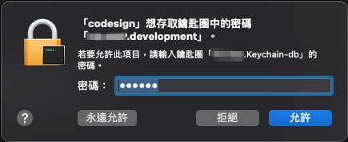
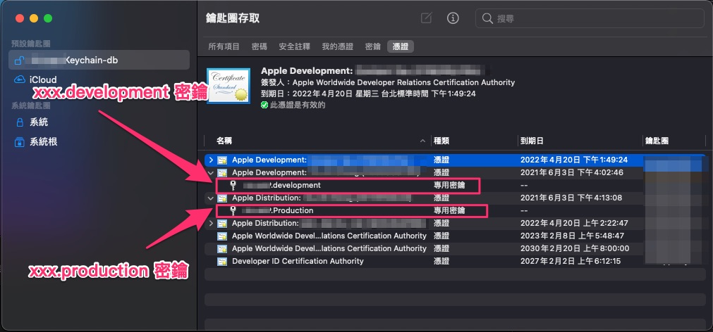

# CodeSign for Xcode

編譯 iOS ipa 時，使用 keycahin 來管理開發者憑證，

會有 codesign 第一次使用 keychain 中的密鑰詢問，

釐清詢問時機。

- 撰寫起始時間 : 2021-04-21

---

## 大綱

- [CodeSign for Xcode](#codesign-for-xcode)
  - [大綱](#大綱)
  - [緣由](#緣由)
  - [分析](#分析)
  - [結論](#結論)

---

## 緣由

有同仁在詢問，使用 自己包裝的 keychain 後，

透過腳本編譯 iOS 的 ipa，

同一個專案，編譯 debug 後有按下永遠允許，

怎麼接下來編譯 release 時會在卡住，

要在按下永遠允許一次。

---

## 分析

codesign 詢問 keychain 的密鑰時，

可以按下永遠允許，使其不在詢問，

不過針對不同的密鑰，不論是否在包裝 keychain 時有設定永遠允許，

皆會詢問一次。

- codesign for app.development

  

- codesign for app.production

  

- keychain private key

  

---

## 結論

重新匯入 private-keychain 到鑰匙圈後，

codesign 需要用到的 private key，

每一個 private key 在第一次使用該 private key 訪問權限時皆會詢問一次。

> 最好出現時，選擇永遠允許，要不然下次用到時可能會再出現。

---

[=> Top](#codesign-for-xcode)

[=> Go Back](../README.md)
