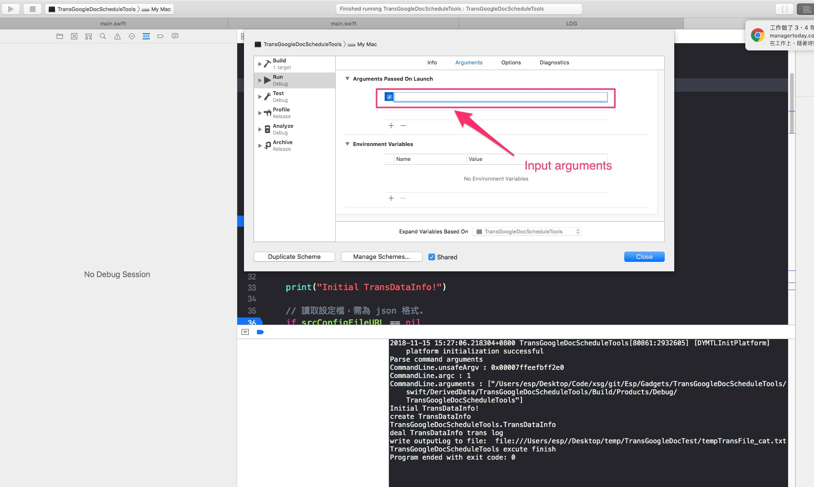

# CommandLine Debug 設定

  想要直接下中斷點來看 command line 的帶入參數。

---

## 大綱

- [CommandLine Debug 設定](#commandline-debug-設定)
  - [大綱](#大綱)
  - [概述](#概述)
  - [設定方式如下](#設定方式如下)
  - [小結](#小結)

---

## 概述

- 使用情境
  
  在command line專案中，有時會處理 command line 的 argument。

  此時在debug階段時，會想要直接下中斷點來看 command line 的帶入參數。

  遇此狀況時可用下列的步驟來模擬實際上的參數。

---

## 設定方式如下

- step1 : Edit Scheme
  
  

- step2 : 修正 [Run][Arguments]
  
  

- step3 : 選擇新增參數
  
  

- step4 : 輸入要測試的參數
  
  

- step5 : 執行 Run 的結果，有下中斷點
  
  

---

## 小結

透過上述的方式即可下中段驗證剖析參數是否如預期方式

---

[=> Top](#commandline-debug-設定)

[=> Go Back](../README.md)
