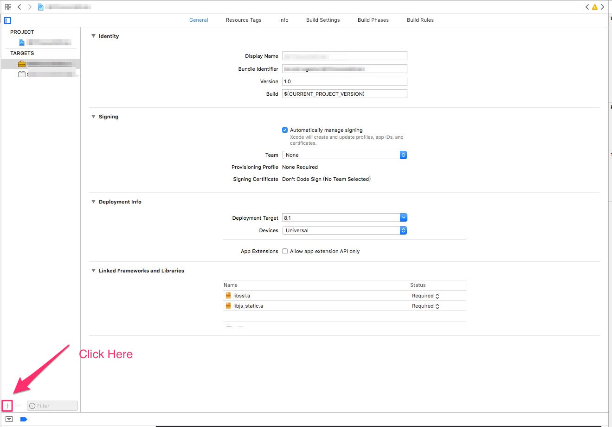
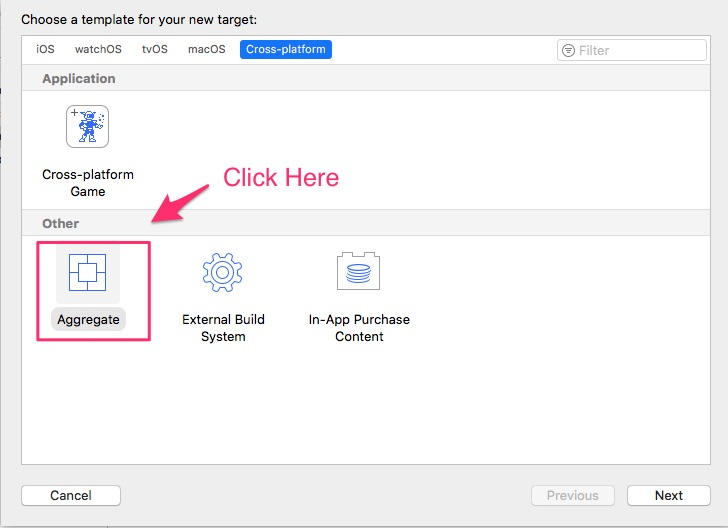
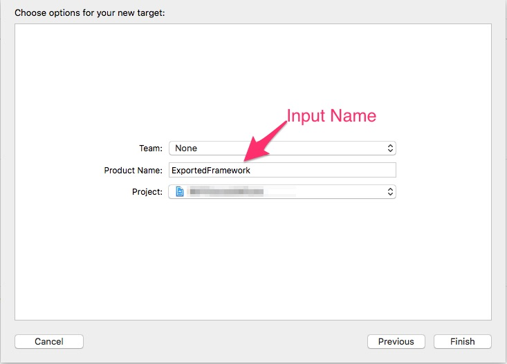
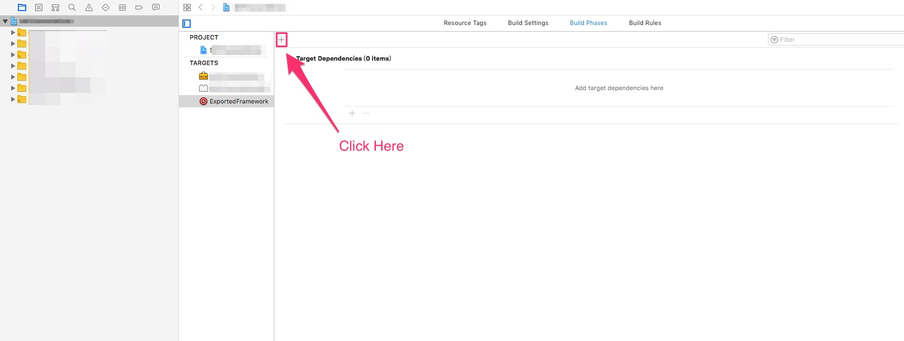
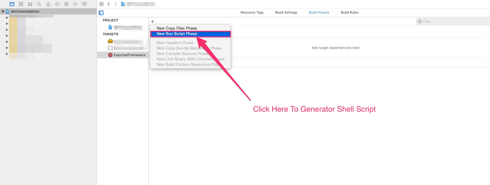

# Exported Framework With Aggregate

在 Xcode 專案中，可透過 shell script 來產出 framework 的設定方式。

---

## 大綱

- [Exported Framework With Aggregate](#exported-framework-with-aggregate)
  - [大綱](#大綱)
  - [概述](#概述)
  - [設定方式如下](#設定方式如下)

---

## 概述

- 使用情境
  
  有建立 frawork 專案，在產出 framework 有使用 shell script 來產出 fat framework。

  > 包含 simulator，devices。

  在修改測試過程，若不想透過 terminal 來呼叫 shell script，

  則可以在專案設定新增 aggregate 的 target，

  可用此 target 來執行寫好的 shell script，

  方便快速產出及測試所寫的 framework 。

---

## 設定方式如下

- step1 : Add New Target
  
  

- step2 : choose Aggregate
  
  

- step3 : Input Name
  
  

- step4 : 新增 Build Phase
  
  

- step5 : 新增 shell script phase
  
  

  > 在此呼叫寫好的腳本，或直接在上面攥寫可行。

如此就可以透過 target 來呼叫該 shell script。

---

[=> Top](#exported-framework-with-aggregate)

[=> Go Back](../README.md)
