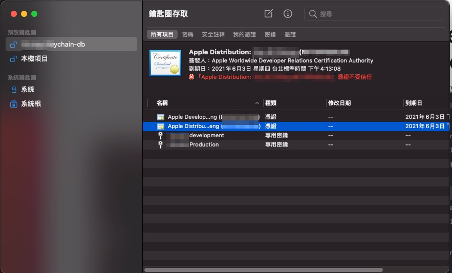
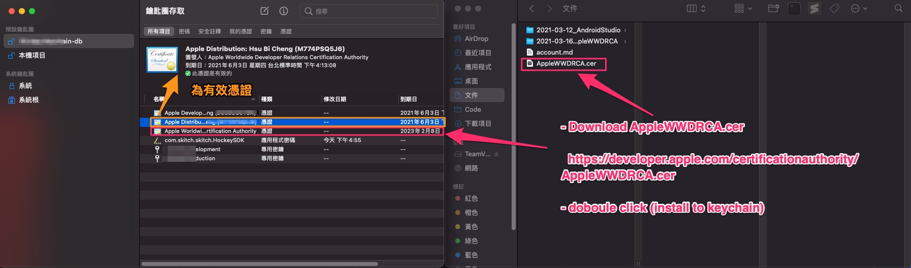
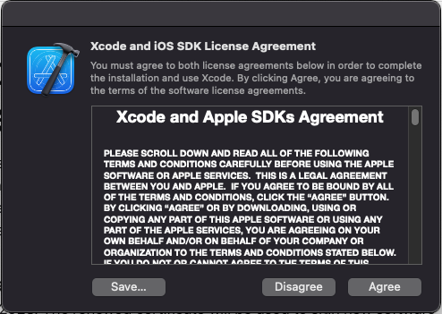
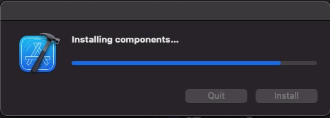
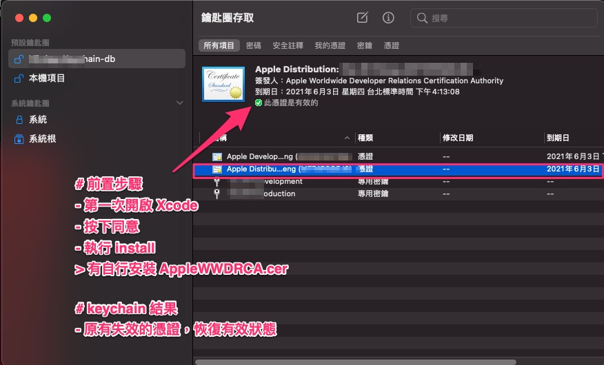
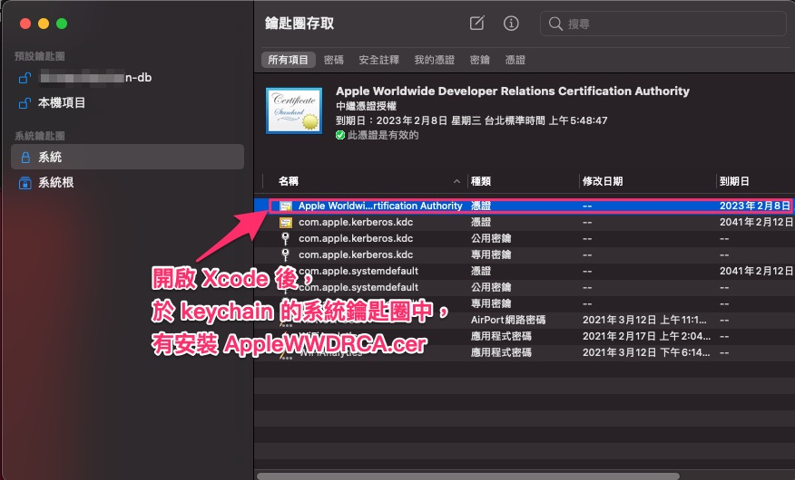

# iOS 開發者憑證失效

  在新的 mac mini (m1) 設定環境時，

  於匯入開發者憑證階段，發現開發者憑證失效問題，

  此篇為當時的紀錄說明。

---
---

## 大綱

- [iOS 開發者憑證失效](#ios-開發者憑證失效)
  - [大綱](#大綱)
  - [歷程](#歷程)
  - [結論](#結論)
  - [延伸閱讀](#延伸閱讀)
    - [Apple WWDRCA](#apple-wwdrca)
    - [Xcode 更新下載機制](#xcode-更新下載機制)
  - [參考](#參考)

---
---

## 歷程

> 時間 : 2021-03-16

- 前提

  有先安裝過 Xcode。

  > 不過只有單純下載安裝，尚未啟動過，
  >
  > 此為這次問題的主因，後續會說明。

- 匯入開發者憑證

  透過包裹的鑰匙圈來匯入相關憑證。

  

  > 可發現開發者憑證到期日還未到，但是該憑證卻不受信任。

- 下載並匯入 Apple WWDRCA 根憑證

  網路上查詢文章，有一說是因為 Apple WWDRCA 中間證書失效 (或者沒有此中間證書)，
  
  尚不知原因，先手動下載來試看看。

  

  - 本次測試使用的 [AppleWWDRCA 備份](./doc/AppleWWDRCA.cer)。

- 啟動 Xcode

  由於 Apple 官方有說明在 Xcode 11.4.1 之後會自動更新，

  > 細節可參照 [Xcode 更新下載機制](#xcode-更新下載機制)

  但是此案例已經有下載過，想到可能沒有啟動過 Xcode 關係，

  所以來啟動試看看現象為何。

  

  > 執行前有先刪除手動匯入的 AppleWWDRCA.cer 。

- Install Components by first launch Xcode

  第一次啟動 Xcode，會需要安裝一些東西。

  

- 確認開發者憑證的有效性

  

  - 沒有手動匯入的 AppleWWDRCA.cer

  - iOS 的開發者憑證也是有效的

- 確認 Xcode 下載的 AppleWWDRCA.cer 匯入位置

  

  由上圖可知， Xcode 下載的 AppleWWDRCA.cer 會安裝在 [keychain][系統鑰匙圈][系統]。

---
---

## 結論

主要原因瞭解了，因為當初只有安裝 xcode 後，

沒有開啟過 xcode，啟動後會在下載並安裝一些東西，
  
所以有些東西沒有安裝到 mac os。

此次問題在於 Apple WWDRCA.cer 沒有安裝到導致的開發者憑證失效狀態。

啟動 xocde 後就解決了 (撒花)。

> 與 m1 無關，與 Xcode 安裝完沒有啟動有關。

---
---

## 延伸閱讀

- [WWDR Intermediate Certificate Expiration - Support - Apple Developer](https://developer.apple.com/support/expiration/)

  可由此知道 Apple WWDRCA 作用，基本上以我們的例子為，
  
  開發者憑證是由 Apple Worldwide Developer Relations Certificate Authority 來派發 cer，
  
  而 AppleWWDRCA.cer 為該機構的中間證書。

### Apple WWDRCA

- 說明 (原文) :

   To help protect customers and developers, we require that all third-party apps, passes for Apple Wallet, Safari Extensions, Safari Push Notifications, and App Store purchase receipts are signed by a trusted certificate authority. The Apple Worldwide Developer Relations Certificate Authority issues the certificates you use to sign your software for Apple devices, allowing our systems to confirm that your software is delivered to users as intended and has not been modified.

### Xcode 更新下載機制

- Xcode 11.4.1 之後會自動更新 說明 (原文) :

  The new Apple Worldwide Developer Relations Intermediate Certificate is downloaded automatically by Xcode 11.4.1 or later and is available for download on the Certificate Authority page. Confirm that the correct intermediate certificate is installed by verifying that the expiration date is set to 2030.

- [Apple PKI - Apple](https://www.apple.com/certificateauthority/)

  Apple PKI 的下載處，Apple WWDRCA 也在此可下載。

---
---

## 參考

- [iO证书不受信任的原因及解决方案 - 简书](https://www.jianshu.com/p/af6acf3cd484)

- [WWDR Intermediate Certificate Expiration - Support - Apple Developer](https://developer.apple.com/support/expiration/)

  > Xcode 11.4.1 (含) 之後會自動下載 Apple WWDRCA

- [Apple PKI - Apple](https://www.apple.com/certificateauthority/)

  > Apple PKI : Apple 公鑰的相關檔案存放處。

---

[=> Top](#ios-開發者憑證失效)

[=> Go Back](../README.md)
