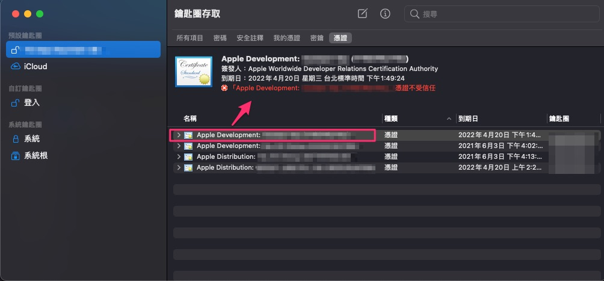
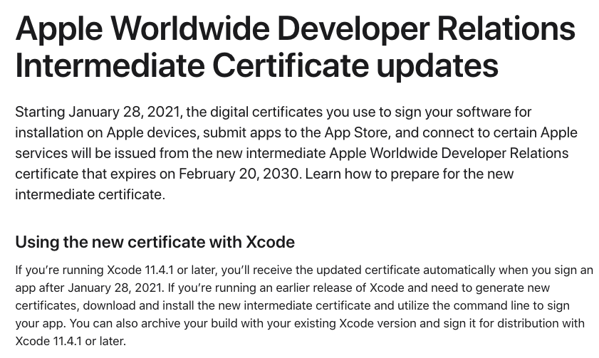
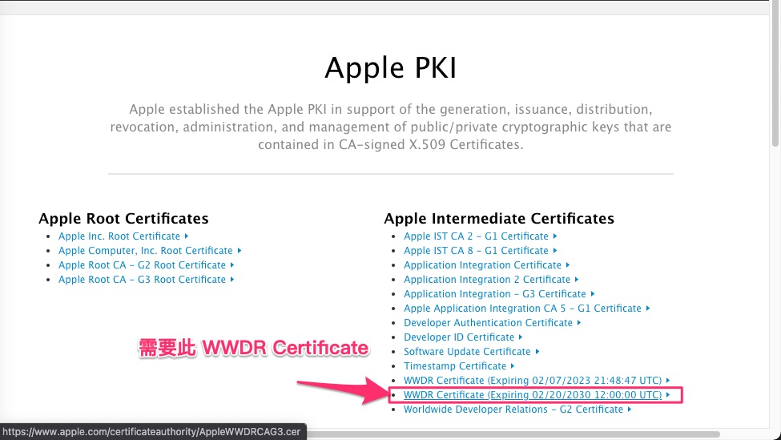
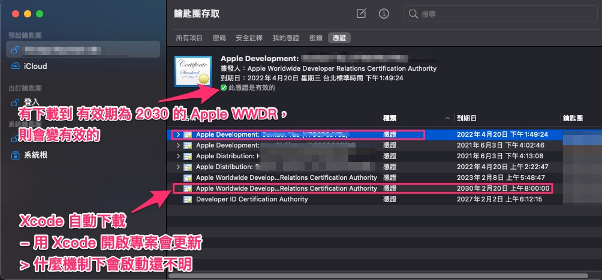
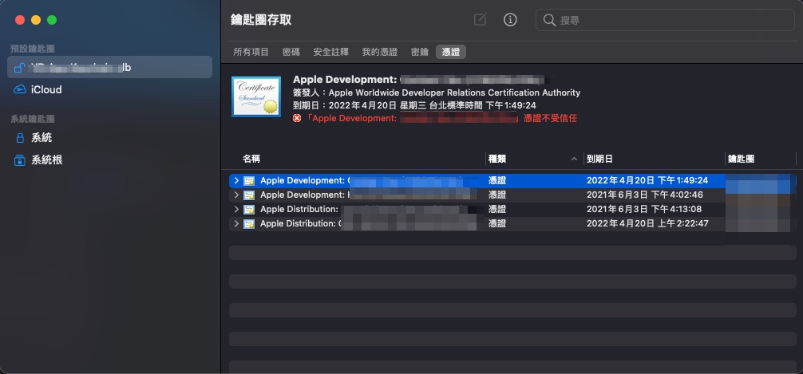
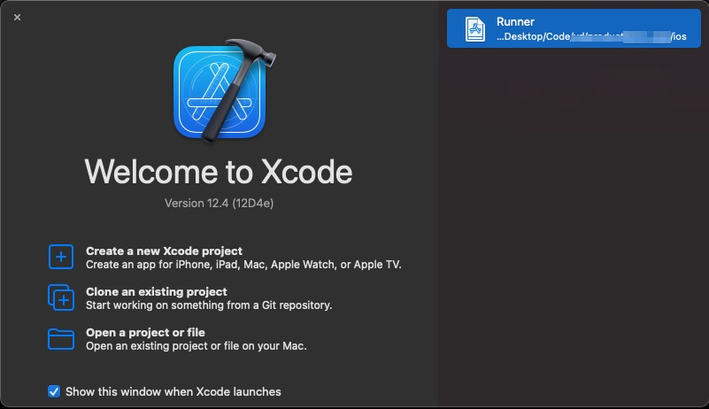
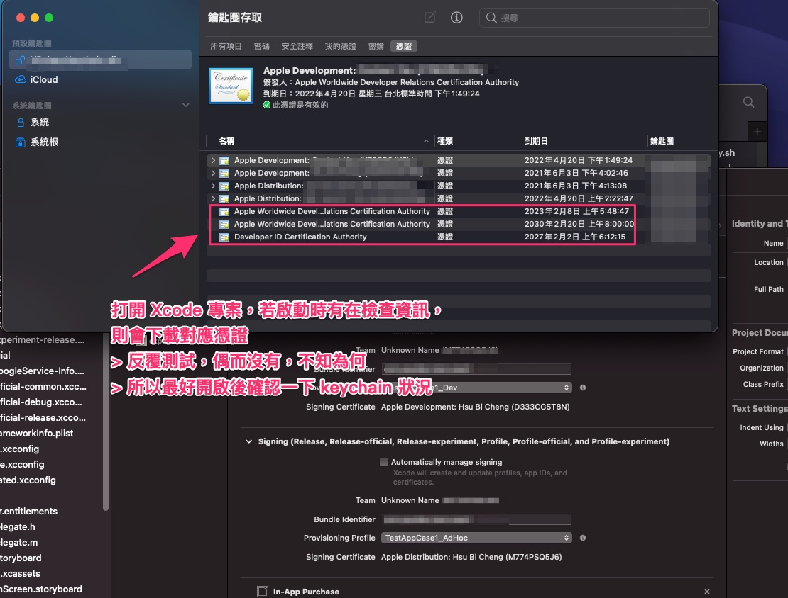

# iOS 開發者憑證失效 PartII

  在新的 mac mini (m1) 設定環境時，

  於匯入開發者憑證階段，發現開發者憑證失效問題，

  此篇為當時的紀錄說明。

- 撰寫起始時間 : 2021-04-20

---
---

## 大綱

- [iOS 開發者憑證失效 PartII](#ios-開發者憑證失效-partii)
  - [大綱](#大綱)
  - [緣由](#緣由)
  - [分析](#分析)
  - [結論](#結論)
  - [參考](#參考)

---

## 緣由

於 2021-04-20 新增一個 iOS 開發者帳號的憑證時，

發生一個奇怪的現象，另一個開發者帳號對應憑證是正常的，

> 之前產生的

但這次新的開發者帳號的憑證卻是失效狀態。

> 感覺上怪怪的，有點像之前遇到 Apple WWDR Certificate 失效問題，
>
> 但又些微的不同。

---

## 分析

**情境 :**

- 如下圖 : 新增的 iOS 開發者帳號對應的 development 憑證顯示失效

  

**可能原因 :**

- [Apple Worldwide Developer Relations Intermediate Certificate - Support - Apple Developer](https://developer.apple.com/support/wwdr-intermediate-certificate/)

  - 節錄原文

  

  上面有提到兩個重點 :

  - 新的 Apple WWDR Certificate

    2021-01-28 之後的開發者憑證需由新的 WWDR Certificate (Expiring 02/20/2030 12:00:00 UTC) 來產生。

    可手動下載[檔案](https://www.apple.com/certificateauthority/AppleWWDRCAG3.cer)，匯入到 keycahin。

    > 或可到 [Apple PKI - Apple](https://www.apple.com/certificateauthority/) 來找對應下載。

  - Xcode 自動更新機制

    於 Xcode 11.4.1 (以及之後版本) 會自動下載。

- [Apple PKI - Apple](https://www.apple.com/certificateauthority/)

  可於 apple 提供的 PKI 檔案，手動下載對應的檔案來先行驗證。

  

---

**mac mini 環境 :**

- 環境為 Xcode 12.x

  由於我們當下使用版本已經是 12.x 版了，理應會自動下載，

  所以下面主要是在查找原因。

---

**測試過程 :**

- xcodebuild

  本來有使用 flutter build ios，

  但是看來沒有自動下載 cer。

- Xcode IDE

  後來有段過程，剛好有開啟 Xcode 在試一些東西，

  回頭看 keycahin ， 憑證突然成變有效了。

  

---

**鎖定開啟 Xcode 測試:**

接下來，則反覆測試重新 import comsumer keychain，

先導致新的 開發者憑證失效後，再打開 Xcode 來驗證是否會自動更新 Apple WWDR Certificate。

反覆執行下列步驟

- 重新 import keycahin

  

  > 此時新的開發者憑證為失效狀態

- 開啟某個 Xcode 專案

  

  > 若只開啟 Xcode，不會自動更新，等再久都一樣。

- 開啟某個 Xcode project 後，確認 keycahin 內容

  

---
---

## 結論

開啟 Xcode project，在上方列會有轉圈圈的過程，

此時有極高機率會下載到 Apple WWDR Certificate，

偶而會遇到沒有下載成功的案例，

若沒有成功下載，則需要再重新開啟一次。

> 目前尚未找到有無 command line 可以檢查更新。

---
---

## 參考

- [Apple Worldwide Developer Relations Intermediate Certificate - 支持 - Apple Developer](https://developer.apple.com/cn/support/wwdr-intermediate-certificate/)

- [Apple Worldwide Developer Relations Intermediate Certificate - Support - Apple Developer](https://developer.apple.com/support/wwdr-intermediate-certificate/)

- [Apple PKI - Apple](https://www.apple.com/certificateauthority/)

  > Apple PKI 的下載處，Apple WWDRCA 也在此可下載。

---
---

[=> Top](#ios-開發者憑證失效-partii)

[=> Go Back](../README.md)
