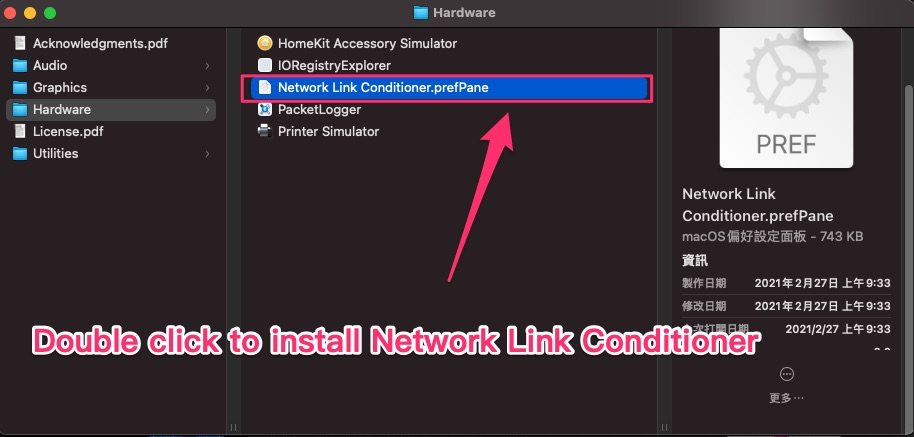
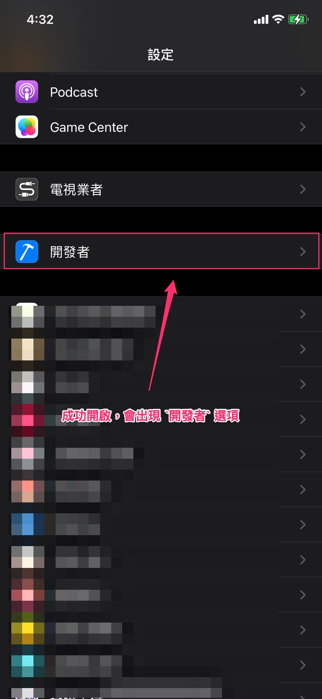
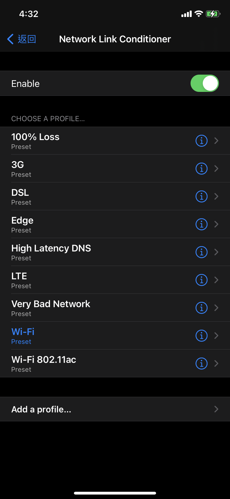

# Network Link Conditoiner

Apple 提供的模擬網路環境的工具， 有 Mac 以及 iPhone 啟用的方式說明。

---

## 大綱

- [Network Link Conditoiner](#network-link-conditoiner)
  - [大綱](#大綱)
  - [概述](#概述)
  - [Network Link Conditoiner for Mac](#network-link-conditoiner-for-mac)
  - [Network Link Conditoiner for iPhone](#network-link-conditoiner-for-iphone)
  - [參考](#參考)

---

## 概述

在開發過程，常常會遇到需要特殊的網路環境來進行驗證，

比如爛網，loss 封包等，來驗證 App 會出現的現象，

以及是否可以運作。

此時，可利用 Xcode 提供的進階功能，來模擬網路環境。

---

## Network Link Conditoiner for Mac

我們可以透過 mac 上面的 Xcode Addtional Tools，

安裝其 Network Link Conditoiner 工具，

即可在 mac 上面的設定開啟網路的模擬環境，

此時透過 mac 的相關網路，皆會套用此網路的模擬環境來運作。

(包含 mac 上的 iPhone 模擬器，網頁， 以及透過 mac 當作 wifi ap 給其他裝置連線的網路，皆會受此影響)

- 01 : [More - Downloads - Apple Developer]

  到 Apple 官方的其他下載網頁。

  

- 02 : Search Addtional

  輸入 `Addtional` 關鍵字。

  下載對應安裝的 Xcode 版本的 Addtional 工具。

  

- 03 : 點擊剛剛下載的 Addtional_Tools_for_Xcode_[version].dmg

  掛載剛當下載的 xxx.dmg。
  
  > 此案例為 Addtional_Tools_for_Xcode_12.5.dmg

  

- 04 : 掛載的 Addtional，展開 Hardware 資料夾。

  

- 05 : Double Click To Install NetworkLink Conditioner

  

- 06 : 點擊安裝繼續

  

- 07 : 需輸入登入 mac 帳號的密碼。

  

- 08 : 啟動 Network Link Conditioner 畫面 (@ mac)

  

- 09 : Profile List

  點選下拉式清單 (Profile)，會出現預設的可切換的環境清單。

  

- 10 : 可客製化網路環境設定選項

  

- 11 : [系統偏好設定] [Network Link Conditioner]

  下次要開啟設定時，可於 [系統偏好設定] [Network Link Conditioner] 來開啟該工具。

  

---

## Network Link Conditoiner for iPhone

若沒有安裝 mac 的 Network Link Conditoiner，

另一個方式是，可於 iPhone 手機，開啟 `開發者` 模式功能，

裡面也有 `Network Link Conditoiner` 的 iPhone 版本，

但只能於該手機模擬網路環境測試。

**開啟步驟 :**

iPhone 預設非 `開發者` 模式。

如何開啟手機的 `開發者` 模式。

可透過下列步驟開啟 :

- mac 開啟 Xcode 。
  
- mac 連結手機 (透過 usb 線)。

- 按下手機的信任。

**驗證手機開發者功能 :**

- 01 : 確認 [設定] [開發者]

  成功開啟，則會在 iOS 系統設定找到 `開發者` 的項目。

  

- 02 : 點選 [開發者]

  此為 [開發者] 畫面，

  可以再點選 Network Link Conditioner 進入細部設定。

  

- 03 : Network Link Conditioner 說明

  預設不開啟，可點選 Enable 開始進行網路環境模擬測試。

  

- 04 : 開始測試

  Profile 與 Mac 上面的相同。

  只是此為 iPhone 單一手機的模擬網路環境測試。

  

---

## 參考

- [More - Downloads - Apple Developer]

  > Apple 官方的下載頁面。

- [調整模擬器網速的 Network Link Conditioner | by 彼得潘的 iOS App Neverland | 彼得潘的 Swift iOS App 開發問題解答集 | Medium]

- [Xcode 11 方便 debug 的 Device Conditions & Environment Overrides | by 彼得潘的 iOS App Neverland | 彼得潘的 Swift iOS App 開發問題解答集 | Medium]

  > Xcode 11 以後的新 debug 功能。

<!-- 連結設定 -->

[More - Downloads - Apple Developer]:
  https://developer.apple.com/download/all/

[調整模擬器網速的 Network Link Conditioner | by 彼得潘的 iOS App Neverland | 彼得潘的 Swift iOS App 開發問題解答集 | Medium]:
  https://medium.com/%E5%BD%BC%E5%BE%97%E6%BD%98%E7%9A%84-swift-ios-app-%E9%96%8B%E7%99%BC%E5%95%8F%E9%A1%8C%E8%A7%A3%E7%AD%94%E9%9B%86/%E8%AA%BF%E6%95%B4%E6%A8%A1%E6%93%AC%E5%99%A8%E7%B6%B2%E9%80%9F%E7%9A%84-network-link-conditioner-e249e2875be6

[Xcode 11 方便 debug 的 Device Conditions & Environment Overrides | by 彼得潘的 iOS App Neverland | 彼得潘的 Swift iOS App 開發問題解答集 | Medium]:
  https://medium.com/%E5%BD%BC%E5%BE%97%E6%BD%98%E7%9A%84-swift-ios-app-%E9%96%8B%E7%99%BC%E5%95%8F%E9%A1%8C%E8%A7%A3%E7%AD%94%E9%9B%86/xcode-11-%E6%96%B9%E4%BE%BF-debug-%E7%9A%84-device-conditions-environment-overrides-dee9596e5d01

[=> Top](#network-link-conditoiner)

[=> Go Back](../README.md)
