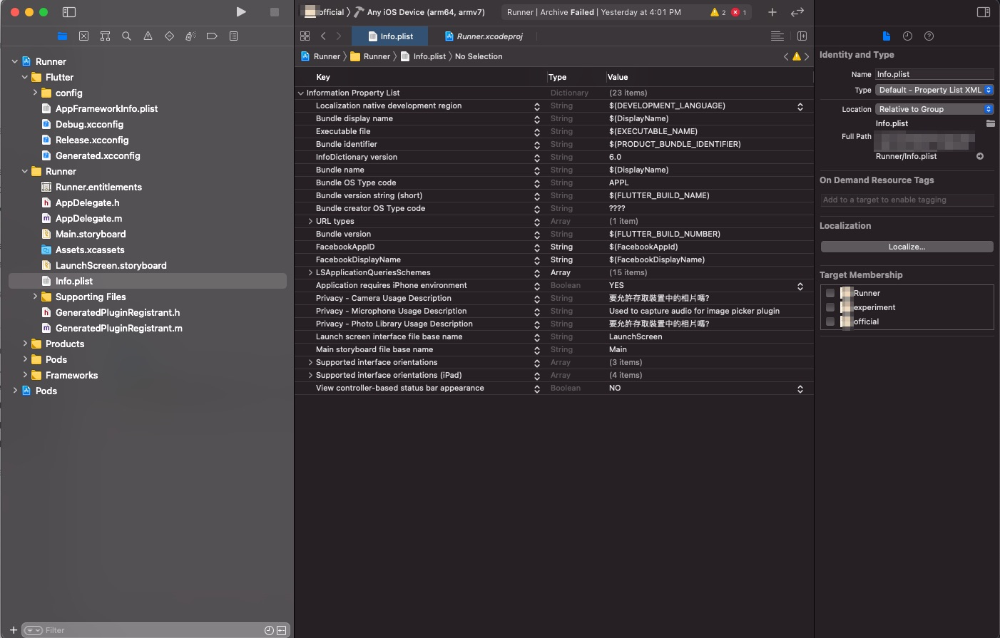
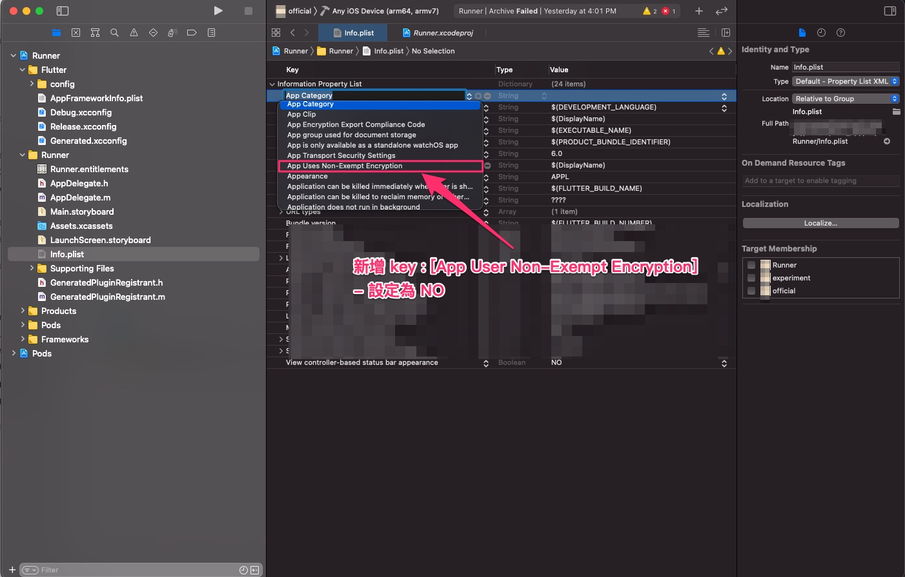
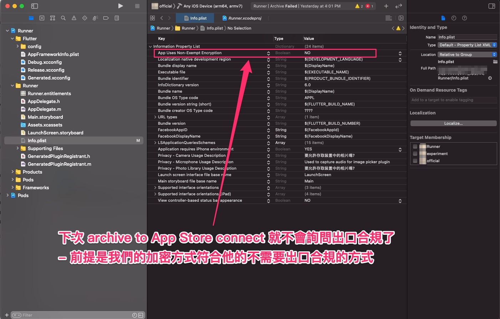

# 自動提供 缺少出口合規資訊

在 iOS 送審過程，archive To App Store Connect 時，

出現 `出口合規` 的相關提示錯誤，需要手動處理。

本文說明，確定 App 符合規範，不需要提供此出口合規文件時，

可以透過 Xcode Project Info.plist 設定，

自動化處理此項目，減少一些人為處理的工。

---

## 大綱

- [自動提供 缺少出口合規資訊](#自動提供-缺少出口合規資訊)
  - [大綱](#大綱)
  - [說明](#說明)
  - [自動提供 缺少出口合規資訊 方式](#自動提供-缺少出口合規資訊-方式)
  - [參考](#參考)

---

## 說明

這邊不贅述何謂出口合規，可參考 [出口合規] 了解。

直接講解如何 自動提供 缺少出口合規資訊 方式。

---

## 自動提供 缺少出口合規資訊 方式

當 App 符合不需要提供出口合規文件時。

如何達到在 Archive To App Store Connect 時，

自動提供 `缺少出口合規資訊` 呢 ？

這樣就可以減少人為的手動步驟。

有參考到部分文章，

如 [APP TestFlight 自動提供 缺少出口合規資訊 - 彼得潘的 Swift iOS App 開發教室 - Medium] 也有提到作法。

這邊有實作此方式，依序如下步驟可完成。

**步驟 :**

- 01 - 開啟專案，到 `Info.plist` 設定頁面

  

- 02 - 新增 App Uses Non-Exempt Encryption 參數

  

- 03 - 設定 [App Uses Non-Exempt Encryption] 內容

  內容設定為 `NO` 。

  > 表示不需要出口合規證明文件。

  

如此，下一次 Archive To App Store 的版本則不需要再手動設定了。

---

## 參考

- [出口合規]

  > 包含出口合規是什麼，以及如何手動解決出口合規問題。

- [APP TestFlight 自動提供 缺少出口合規資訊 - 彼得潘的 Swift iOS App 開發教室 - Medium]

- [蘋果提交版本後顯示”缺少出口合規證明“的解決辦法 - IT閱讀]

---

<!-- 連結設定 -->

[出口合規]: https://github.com/espgrandia/Mobile.Info/blob/master/iOS/Review/Export_Compliance

[APP TestFlight 自動提供 缺少出口合規資訊 - 彼得潘的 Swift iOS App 開發教室 - Medium]: https://medium.com/%E5%BD%BC%E5%BE%97%E6%BD%98%E7%9A%84-swift-ios-app-%E9%96%8B%E7%99%BC%E6%95%99%E5%AE%A4/app-testflight-%E4%B8%AD%E8%87%AA%E5%8B%95%E6%8F%90%E4%BE%9B-%E7%BC%BA%E5%B0%91%E5%87%BA%E5%8F%A3%E5%90%88%E8%A6%8F%E8%B3%87%E8%A8%8A-5c549fd73de4

[蘋果提交版本後顯示”缺少出口合規證明“的解決辦法 - IT閱讀]: https://www.itread01.com/content/1550360004.html

[=> Top](#自動提供-缺少出口合規資訊)

[=> Go Back](../README.md)
