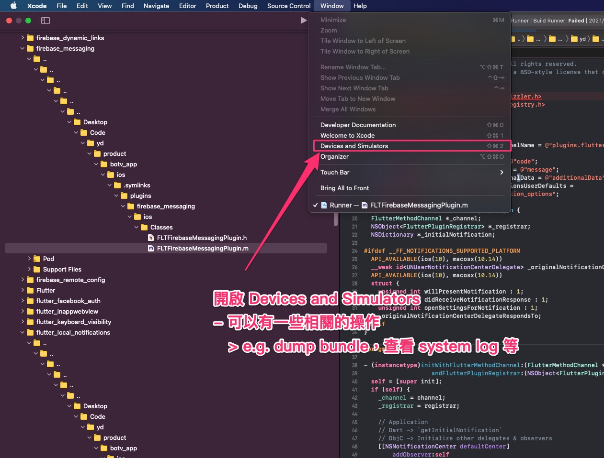
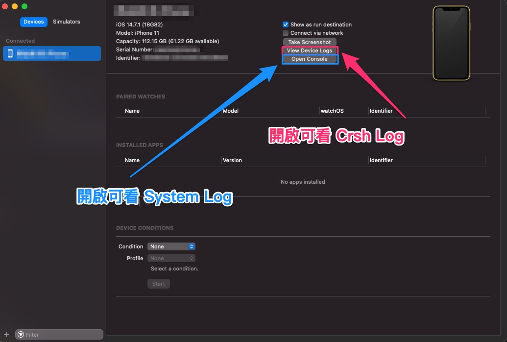
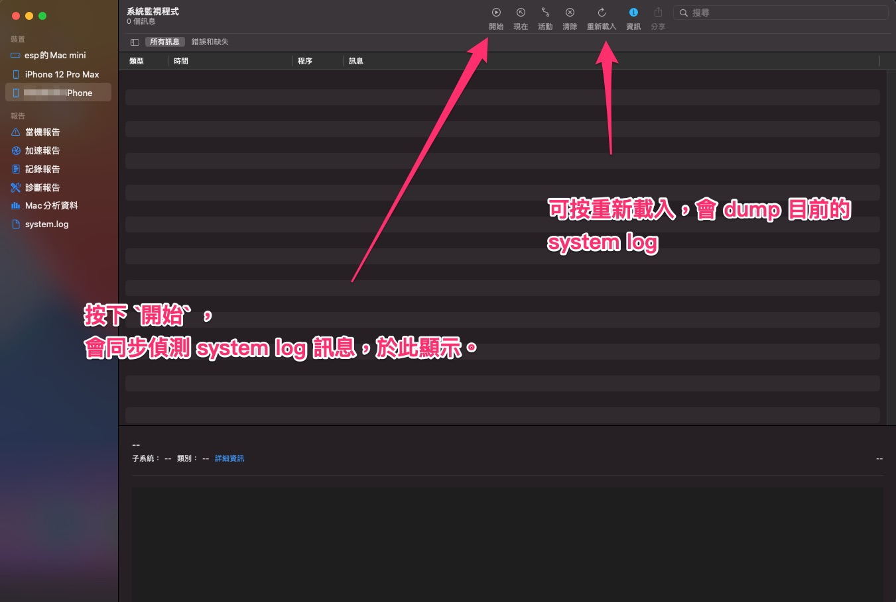
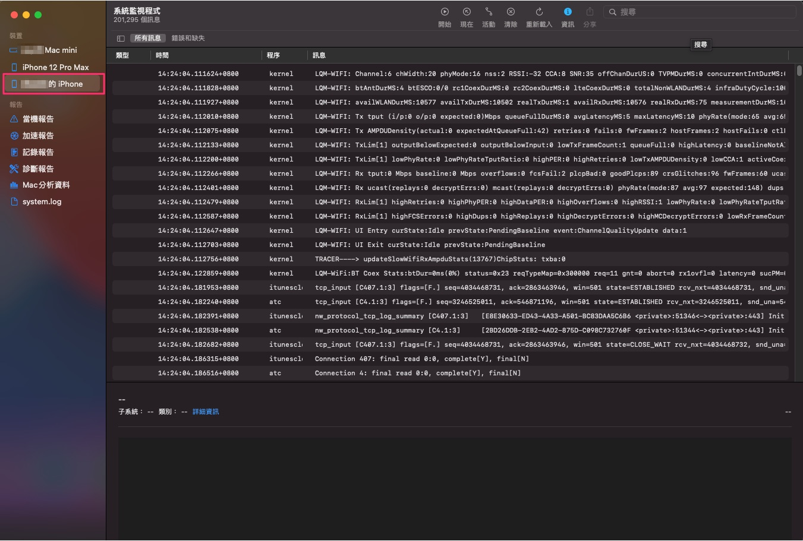
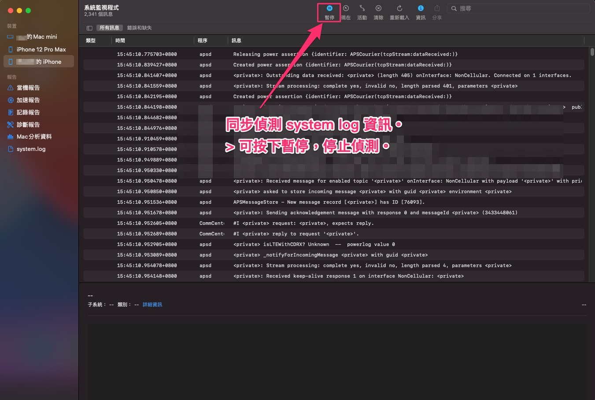

# 系統監視器

在查找問題過程中，有些狀況可能需要使用 Release 來查詢一些錯誤資訊，

於原生可以用 NSLog 或者是 DDLog 等套件，

發送 log 到 system log 中。

而如何觀看 system log，此篇會介紹 Xcode 的啟用方式。

---

## 大綱

- [系統監視器](#系統監視器)
  - [大綱](#大綱)
  - [步驟](#步驟)

---

## 步驟

- 01 : 點選 上方功能列中的 [`Xcode`] [`Windows`] [`Devices And Simulators`]

  

- 02 : `[Devices And Simulators]` Tools 說明

  左欄選擇要觀測的機器 (Device or Simulator)，

  在選取要使用的功能，此次要觀測 System Log，

  所以可以點選 `Open Console` 來開啟相關程式。

  

- 03 : `[系統監視程式]` 說明

  

- 04 : `重新載入` 功能說明

  直接顯示目前機器的 system log。

  > 一次性的讀取資料。

  

- 05 : 開始 偵測 system log

  匯入目前的 system log 外，

  也會即時的偵測，有新增 log ，

  會顯示到視窗中。

  

---

[=> Top](#系統監視器)

[=> Go Back](../README.md)
