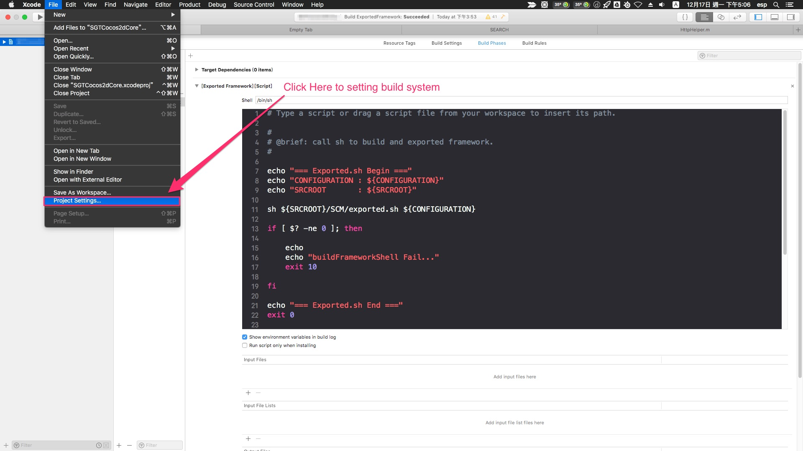
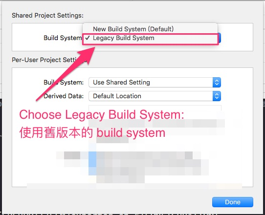
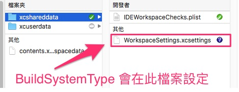

# Xcode10_BuildSystem

  由於 Xcode 10 採用新的 build system，與之前版本不相容，

  此為暫時性的解決方案。

---

## 大綱

- [Xcode10_BuildSystem](#xcode10_buildsystem)
  - [大綱](#大綱)
  - [概述](#概述)
  - [設定方式如下](#設定方式如下)
  - [參考](#參考)

---

## 概述

- 使用情境
  
  在 XXcode 10 以前 (不含 10) 的專案，升級到升級到 Xcode 10 時，

  會遇到 build system 的相容性問題，
  
  可設定專案先使用 Legacy Build System，
  
  可暫時使用舊的 Build System 來處理。

---

## 設定方式如下

- step1 : Click [File][Project Settings]
  
  

- step2 : Choose Legacy Build System
  
  

- step3 : 異動的檔案
  
  

如此則可暫時使用 Legacy Build System，使專案可以 work，

此後比較好的做法還是調整成 New Build System，

對應的錯誤就需要都修正之。

---

## 參考

- [Build System Release Notes for Xcode 10 | Apple Developer Documentation](https://developer.apple.com/documentation/xcode-release-notes/build-system-release-notes-for-xcode-10)

---

[=> Top](#xcode10_buildsystem)

[=> Go Back](../README.md)
