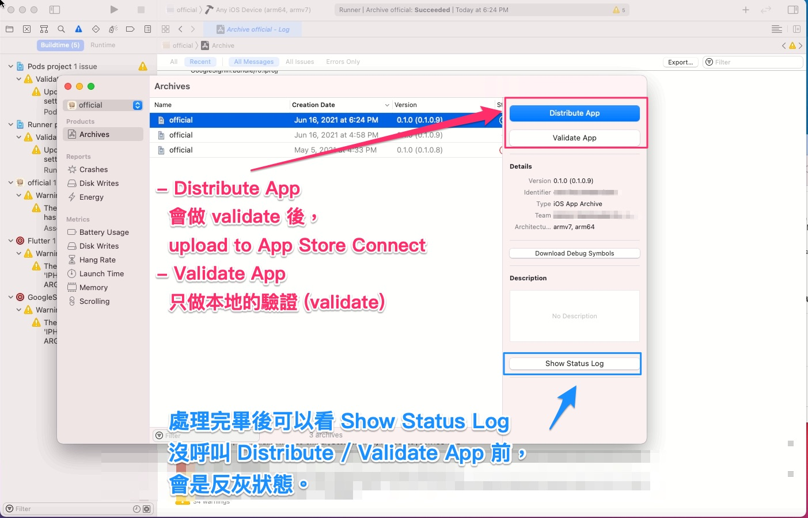
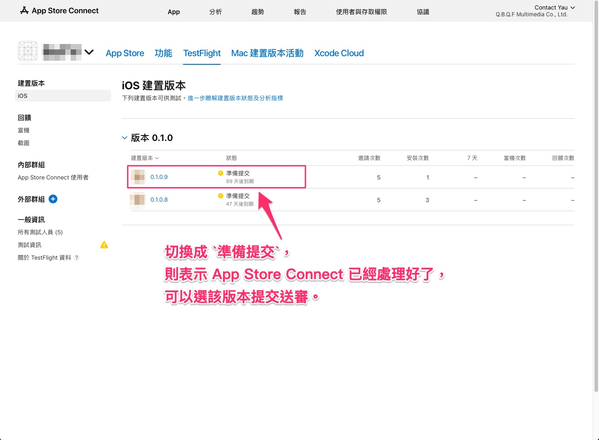

# Xcode Archive Upload To App Store Connect Using Flutter Project

此篇文章要說明的是，Flutter 專案中，

當 iOS 要送審時，需要處理的事項，

主要以講解如何編譯 Xcode archive 的 App Store 版本，

並上傳到 App Store Connect 。

> 圖片為公司某 Flutter 專案中的 iOS 版本送審過程的範例。
>
> 一般的 iOS 專案手動 Archive 也大同小異，
>
> 只要採用一些各自專案的執行應有的步驟即可。

---
---

## 大綱

- [Xcode Archive Upload To App Store Connect Using Flutter Project](#xcode-archive-upload-to-app-store-connect-using-flutter-project)
  - [大綱](#大綱)
  - [說明](#說明)
    - [概念](#概念)
    - [出版環境](#出版環境)
    - [步驟](#步驟)
  - [影片說明](#影片說明)
  - [附註](#附註)
  - [補充 (2022-07-08)](#補充-2022-07-08)

---
---

## 說明

### 概念

以 iOS 送審來說，主要概念為，

手動的執行步驟可以用下面的原則來掌握。

- Xcode Archive

  確保該專案的 Xcode Archive 是要產出送審的版本。

- Xcode - Organizer - Distribute App

  已經產出好的 archive，

  透過 Xcode 的 Organizer 視窗，

  可以選擇 Distribute App，

  執行完畢就可以 Update archive To App Store Connect。

- App Store Connect - Check 版本

  確認上傳的版本已經處理好了。

  > 處理好的版本在 [TestFlight] 會顯示 `準備提交`

- App Store Connect - 產品說明 - 選擇建置版本

  已經處理好的版本，可以在產品說明頁面選擇該建置版本。

- App Store Connect - 產品說明 - 提交以供審查

  確認產品說明的內容無誤，即可以提交以供審查，

  後續則等待 Apple 審核的回覆結果。

---

### 出版環境

目前是手動處理，一般在內測時，

會使用 gitlab 做 CI 發布版本，

而 gitLab CI 觸發時會透過共用機來執行包版的自動化操作。

為了環境上的一致性，在處理送審的 Archive to App Store Connect 流程時，

也會需要連到該共用幾做實際上的操作。

> 共用機的帳密可透過相關人員取得，這邊不作描述。

---

### 步驟

- 01 - Open Xcode

  

- 02 - 開啟要上傳的專案的 Signing 設定頁面

  - Position :

    [Runner] [Targets] [official] [Signing & Capabilities]

  **範例 :**

  - Target : official

  - Configuration Type : Release

  - Provision Prfofile : [AppName]_AdHoc

    > git commit 上傳為 [AppName]_AdHoc，
    >
    > 此為內測是可以透過 gitlab CI 出版測試使用。

  

- 03 - 修正 Provision Profile

  [續上] : 修正可以 archive to App Store Connect 的 Provision Profile。

  **範例 :**

  - Target : official

  - Configuration Type : Release

  - Provision Prfofile : [AppName]_AppStore

    > [AppName]_AppStore 為 AppStore 形式的 Provision Profile，
    >
    > 可上架使用的 Provision Profile。

  

- 04 : 修正 `preExported.sh`

  改成只產出 iOS，加速出版流程。

  > 目前會產出 apk 以及 ipa。
  >
  > 之後若調整 `preExported.sh`，
  >
  > 這部分視情況做修正。

  

- 05 : 修正 `preExported.sh`

  改成只產出 Release，

  之後要使用 archive 時，

  也是對應 Flutter 的 Release。

  > 之後若調整 `preExported.sh`，
  >
  > 這部分視情況做修正。

  

- 06 : 執行 `preExported.sh`

  產出 Release 的 ipa，

  此目的為 透過 flutter build ，

  產生對應的 Flutter 編譯後的 binary code。

  > 包含 Flutter.framework (Flutter 底層)，
  >
  > App.framework (實作層部分)。

  

  - 附註 : Flutter 在 Debug 與 Release 產出的 Binary Code 不同。

- 07 : 確認 `preExported.sh` 是否執行成功

  

- 08 : 檢查 Generated.xcconfig

  可於 Generated.xcconfig 檔案中，

  驗證 Flutter 的相關設定以及環境是否符合預期。

  

  - 附註 :

    關於 flutter build io 編譯過程會產出 Generated.xcconfig 檔案，

    Generated.xcconfig 會有一些 Flutter 與 iOS 專案的相關設定，

    提供給後續的 xcode 編譯使用。

- 09 : 確認 Archive 的設定是否有跑掉

  要 Archive to App Store Connect ，

  需透過 Archive 的打包 [xxx].xcarchive

  > xcarchive 為套件的副檔名。

  

  - 附註 :

    若想看實際打包的套件內容，

    除了透過 Xcode 上方的功能列表，

    打開 Organizer 後後，

    針對其中一個 archive 按下滑鼠右鍵，

    點擊 `show in finder` 外，
  
    亦可直接到下方的路徑查看。

    > path : /Users/app_share/Library/Developer/Xcode/Archives
    >
    > e.g. `official 2021-6-16, 6.24 PM.xcarchive`

- 10 : 執行 Archive

  確認要 Archive 的 Target 都設定無誤後，

  可執行 Xcode 上方選單中的 Archive，

  即可執行 Archive 。

  

- 11 : Distribute App

  Archive 完成，

  會跳出 Organizer 的視窗，

  可針對要發布的 archive，

  點選 Distribute App ，

  會在經過一些選項設定，

  即可上傳到 App Store Connect。

  > 完成後，接下來則是等待 App Store Connect 的後續處理了。

  

- 12 : App Store Connect 的處理狀態 (`處理中`)

  可登入 App Store Connect，

  進入對應 App 的 TestFlight，

  查詢剛剛 Distribute App 的版本，
  
  目前 App Store Connect 對應該版本的狀態。

  > `處理中` : 表示正在處理，此時無法選擇此版本送審。

  

- 13 : App Store Connect 的處理狀態 (`準備提交`)

  當版本狀態切換成 `準備提交`，

  則表示 App Store Connect 已經處理完畢。

  

- 14 : 選擇送審的的建置版本

  當版本狀態切換成 `準備提交`，

  可切換頁面到 App Store 的產品說明頁面。

  > 此時若要送審，可以選擇該建置版本提交審查。

  

- 15 : 完成送審的的建置版本

  剛剛選擇的建置版本後，
  
  在產品資訊會自動抓取對應的 app icon。

  

- 16 : 提交以供審查

  確認資訊無誤後，可以提交以供審查，來進行送審。

  > 通常按下提交以供審查後，
  >
  > 大概只能等待 Apple 的回覆了，
  >
  > 或者開發者可以自行 reject，此為特殊的處理狀況。

  

  - 附註 :

    通常產品的其他資訊，諸如關鍵字，

    App 說明內文，

    會以營運提供素材來處理，

    一般不會是來執行修改內文。

    App 開發者主要是確認版本是否是要送審的版本。

    提交審查可能是交由維運的角色來處理較為合適。

    > 實際上看該產品的實際運作為何。

- 17 : 提交審查後的資訊

  按下提交審查後，會進入 `Waiting For Review`，

  此時還未正式審查，等待審查期間，

  App 資訊還能修改。
  
  > 一進入 `InReview` 則不行修改了。

  

- 18 : 可在版本紀錄查看目前的審查狀態

  

---

## 影片說明

以下的影片為一些實際操作時的紀錄影片，

提供一些說明，

影片有經過裁剪，實際上會更久。

- 01 - xcode archive

  - [影片連結](./video/video_01_xcode_archive.mov)

    [](./video/video_01_xcode_archive.mov "xcode_archive")

  實際操作 Xcode archive 的影片。

- 02 - Xcode Validate App

  archive 好的版本，

  若想要在 local 端驗證 App 是否合規，

  可以點擊 `Validate App` 來做驗證。

  > 若確認此 archive 要直接推到 App Store Connect，
  >
  > 可略過此步驟，
  >
  > 在 Distribute App 過程也會驗證一次。

  - [影片連結](./video/video_02_xcode_Validate_App.mov)

    [](./video/video_02_xcode_Validate_App.mov  "xcode_Validate_App")

- 03 - Xcode Distribute App

  點擊 Distribute App，

  執行該 archive 送交到 App Store Connect 的處理程序。

  > 會先做 Validate，
  >
  > 沒問題後，才會將 archive 上傳到 App Store Connect。

  - [影片連結](./video/video_03_xcode_Distribute_App.mov)

    [](./video/video_03_xcode_Distribute_App.mov  "xcode_Distribute_App")

---
---

## 附註

- 圖片擷取日期 : 2021-06-16

- 文件撰寫日期 : 2021-07-20

---
---

## 補充 (2022-07-08)

在 Flutter 2 之後， flutter build command line，

有新增 subcommands，相關資訊如下。

- flutter --version

  ```sh
  Flutter 2.10.5 • channel stable • https://github.com/flutter/flutter.git
  Framework • revision 5464c5bac7 (3 months ago) • 2022-04-18 09:55:37 -0700
  Engine • revision 57d3bac3dd
  Tools • Dart 2.16.2 • DevTools 2.9.2
  Build an executable app or install bundle.
  ```

- flutter build --help :

  ```sh
  Global options:
  -h, --help                  Print this usage information.
  -v, --verbose               Noisy logging, including all shell commands executed.
                              If used with "--help", shows hidden options. If used with "flutter doctor", shows additional diagnostic information. (Use "-vv" to force verbose logging in those cases.)
  -d, --device-id             Target device id or name (prefixes allowed).
      --version               Reports the version of this tool.
      --suppress-analytics    Suppress analytics reporting when this command runs.

  Usage: flutter build <subcommand> [arguments]
  -h, --help    Print this usage information.

  Available subcommands:
    aar             Build a repository containing an AAR and a POM file.
    apk             Build an Android APK file from your app.
    appbundle       Build an Android App Bundle file from your app.
    bundle          Build the Flutter assets directory from your app.
    ios             Build an iOS application bundle (Mac OS X host only).
    ios-framework   Produces .xcframeworks for a Flutter project and its plugins for integration into existing, plain Xcode projects.
    ipa             Build an iOS archive bundle (Mac OS X host only).
    web             Build a web application bundle.

  Run "flutter help" to see global options.
  ```

- `exported.sh` 支援 subcommands :

  現在出版工具有支援的 subcommands : apk，appbundle，ios，ipa。

- `preExported.sh` 優化 :

  `preExported.sh` 有功能性優化，
  
  帶入的參數，可以指定 subcommands。

  > e.g. preExported.sh ipa.apk
  >
  > 則會產出 ipa 跟 apk 的內容。
  >
  > 實際依照各個專案實作 preExported.sh 的說明。

- 簡化 SOP :

  可以簡化 SOP 的步驟。

  - 原先的步驟概念 :

    先用 `preExported.sh` 編譯，再用 Xcode IDE 產出 [xxx].xcarchive。

  - 簡化後的步驟 :

    可直接使用 `preExported.sh` 產出 [xxx].xcarchive。

  - 說明 :

    上面的步驟原則上差不多，調整完專案的 provision profile 後，

    可以直接使用 `preExported.sh` 帶入 ipa 的相關設定，

    將可透過 commandline 方式，產出 [xxx].xcarchive 的內容，

    做後續的上傳到 App Store Connect 即可。

---
---

[=> Top](#xcode-archive-upload-to-app-store-connect-using-flutter-project)

[=> Go Back](../README.md)
